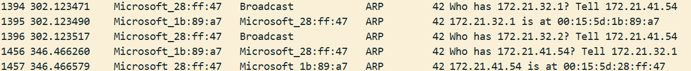
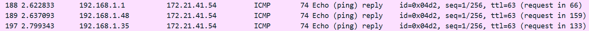
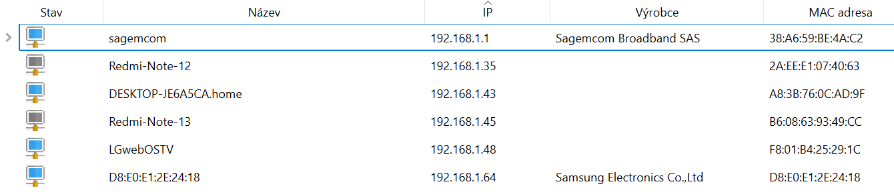
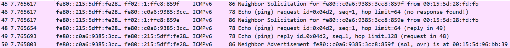

# IPK L2/L3 Network Scanner

## Tomáš Zavadil - xzavadt00

A command-line network scanner that discovers active hosts on IPv4 and IPv6 subnets using Layer 2 (ARP / NDP) and Layer 3 (ICMPv4 / ICMPv6) probes. The scanner sends protocol-specific requests to every host address in the given CIDR range(s) and listens for replies, producing a unified per-host report.

## Table of Contents

- [Project Overview](#project-overview)
- [Build Instructions](#build-instructions)
- [Usage](#usage)
- [Implemented Features](#implemented-features)
- [Design Decisions](#design-decisions)
- [Testing](#testing)
- [Known Limitations](#known-limitations)
- [References](#references)

## Project Overview

`ipk-L2L3-scan` performs active host discovery by combining L2 and L3 scanning techniques:

- **L2 scanning** - ARP requests (IPv4) and NDP Neighbor Solicitations (IPv6) to resolve link-layer (MAC) addresses.
- **L3 scanning** - ICMPv4 Echo Requests and ICMPv6 Echo Requests to verify network-layer reachability.

Results are aggregated into a single, unified output: one line per target IP showing the L2 (MAC) and L3 (reachability) status.

## Build Instructions

### Prerequisites

- C++20-capable compiler (e.g. `g++ ≥ 10`)
- `libpcap` development headers (`libpcap-dev` / `libpcap-devel`)
- POSIX environment (Linux)
- Google Test (`libgtest-dev`) - for unit tests only

### Compiling

```bash
make            # builds the 'ipk-L2L3-scan' binary
```

### Cleaning

```bash
make clean      # removes build artifacts and test binary
```

## Usage

The scanner requires **root privileges** because it opens a raw `AF_PACKET` socket.

```
sudo ./ipk-L2L3-scan -i <interface> -s <subnet> [-s <subnet> ...] [-w <timeout_ms>]
```

### Options

| Flag | Long form       | Description                                       | Default |
|------|-----------------|---------------------------------------------------|---------|
| `-i` | `--interface`  | Network interface to use (required)                | -       |
| `-s` | `--subnet`     | CIDR subnet to scan (required, repeatable)         | -       |
| `-w` | `--wait`       | Timeout in milliseconds to wait for replies        | 1000    |
| `-h` | `--help`       | Show help message and exit                         | -       |

Running with only `-i` (no other arguments) prints a list of active network interfaces and exits.

### Examples

```bash
# Scan a single IPv4 /24 subnet on eth0
sudo ./ipk-L2L3-scan -i eth0 -s 192.168.1.0/24

# Scan multiple subnets with a 2-second wait
sudo ./ipk-L2L3-scan -i eth0 -s 192.168.1.0/24 -s fd00::/126 -w 2000

# List active interfaces
./ipk-L2L3-scan -i
```

### Example Output

```
192.168.1.1 arp OK (aa:bb:cc:dd:ee:ff) icmpv4 OK
192.168.1.2 arp FAIL icmpv4 FAIL
```

## Implemented Features

- **IPv4 CIDR parsing** - Parses subnets like `192.168.1.0/24`; correctly handles `/31` and `/32` per RFC 3021.
- **IPv6 CIDR parsing** - Parses subnets like `fd00::/126`; correctly handles `/127` and `/128` per RFC 6164.
- **ARP scanning** - Crafts and sends ARP requests; parses ARP replies to resolve MAC addresses.
- **ICMPv4 scanning** - Crafts ICMPv4 Echo Requests with correct checksum; parses Echo Replies.
- **NDP scanning** - Sends IPv6 Neighbor Solicitation messages; parses Neighbor Advertisement replies.
- **ICMPv6 scanning** - Sends ICMPv6 Echo Requests; parses ICMPv6 Echo Replies.
- **Packet capture engine** - libpcap-based capture running in a dedicated thread with BPF filtering (`arp or icmp or icmp6`).
- **Centralized result aggregation** - Thread-safe `ScanResultManager` collects L2 and L3 results and prints a unified per-host summary.
- **Interface listing** - When invoked with `-i` only, prints all active network interfaces.
- **Configurable timeout** - `-w` flag sets the wait time for replies.

### Output Format

Each scanned host produces one line:

```
<IP> arp|ndp OK|FAIL [(MAC)] icmpv4|icmpv6 OK|FAIL
```

## Design Decisions

### Architecture

The scanner follows a modular, layered architecture:

1. **Crafter / Listener abstraction** - `PacketCrafter` and `PacketListener` are abstract base classes. Each protocol (ARP, ICMPv4, NDP, ICMPv6) provides a concrete crafter–listener pair, making it straightforward to add new protocols.

2. **PcapEngine** - A separate `PcapEngine` class encapsulates all libpcap interaction (opening the interface, compiling BPF filters, running `pcap_loop` in a background thread). Listeners register with the engine and receive every captured frame.

3. **ScanResultManager** - A thread-safe central store that aggregates L2 and L3 responses. Using a single manager instead of per-protocol printers ensures consistent, unified output and avoids race conditions on stdout.

4. **Raw sockets** - A single `AF_PACKET / SOCK_RAW` socket is shared by all crafters for packet injection, while libpcap handles capture separately.

### Why libpcap for capture?

The `libpcap` library was chosen because it provides a highly robust and standardized API for raw network traffic capture. Its most significant advantage is the support for Berkeley Packet Filter (BPF), which allows the scanner to efficiently filter and isolate only the necessary L2 and L3 responses directly at the kernel level, significantly reducing user-space overhead.

### Thread safety

Because the scanner utilizes a separate background thread for packet capture (`PcapEngine`), we must safely handle concurrent data access. Wait times and sending happen on the main thread, while incoming packet processing (and result updating) happens on the capturing thread.

To prevent race conditions, the `ScanResultManager` acts as our synchronized data store. It protects its internal map of host statuses using a `std::mutex`. When any packet listener decodes a positive response (via `update_l2` or `update_l3`), it acquires the mutex before modifying the shared data, ensuring that the background thread doesn't conflict with main thread reads or writes.

## Testing

### Unit Tests (GTest)

The project includes a Google Test suite covering:

- **CIDR parsing** (`tests/test_cidr.cpp`) - verifies correct subnet parsing, host count, and host IP generation for both IPv4 and IPv6.
- **Packet parsing** (`tests/test_packets.cpp`) - validates listener parsing logic using pre-crafted byte buffers, including ARP replies, ICMPv4 echo replies, NDP Neighbor Advertisements, and ICMPv6 echo replies. Also tests rejection of malformed/truncated packets.

#### Running the tests

```bash
make test       # builds and runs the GTest suite
```

#### Test Results

```text
# Tests parsing of IPv4 CIDR notation (e.g. /32, /31, /24), boundary behaviors, and RFC 3021 compliance.
[       OK ] SubnetIPv4.Slash32_SingleHost (0 ms)
[       OK ] SubnetIPv4.Slash31_PointToPoint (0 ms)
[       OK ] SubnetIPv4.Slash30_NetworkAlignment (0 ms)
[       OK ] SubnetIPv4.Slash24_StandardSubnet (0 ms)

# Tests parsing of IPv6 CIDR notation (e.g. /128, /127), and correct host IP generation.
[       OK ] SubnetIPv6.Slash128_SingleHost (0 ms)
[       OK ] SubnetIPv6.Slash127_PointToPoint (0 ms)
[       OK ] SubnetIPv6.Slash120 (0 ms)

# Tests robustness against malformed input like invalid strings, missing slashes, or out-of-range prefixes.
[       OK ] SubnetErrors.InvalidIPv4Octet (0 ms)
[       OK ] SubnetErrors.InvalidAddressString (0 ms)
[       OK ] SubnetErrors.IPv4PrefixTooLarge (0 ms)
[       OK ] SubnetErrors.IPv6PrefixTooLarge (0 ms)
[       OK ] SubnetErrors.MissingSlash (0 ms)

# Validates the ICMPv4 RFC 1071 internet checksum calculation logic under various byte patterns.
[       OK ] Checksum.AllZeros (0 ms)
[       OK ] Checksum.AllOnes (0 ms)
[       OK ] Checksum.IcmpEchoRequest (0 ms)
[       OK ] Checksum.OddLength (0 ms)

# Tests the L2 ARP packet parser with valid ARP replies and verifies rejection of malformed/truncated frames.
[       OK ] ArpListener.ValidReply (0 ms)
[       OK ] ArpListener.TruncatedPacket (0 ms)
[       OK ] ArpListener.WrongEtherType (0 ms)

# Tests the L3 ICMPv4 packet parser filtering logic, handling valid echo replies and rejecting bad packets.
[       OK ] Icmpv4Listener.ValidEchoReply (0 ms)
[       OK ] Icmpv4Listener.TruncatedPacket (0 ms)
[       OK ] Icmpv4Listener.WrongEtherType (0 ms)

# Tests the L3 ICMPv6 packet parser filtering logic, handling valid echo replies and rejecting bad packets.
[       OK ] Icmpv6Listener.ValidEchoReply (0 ms)
[       OK ] Icmpv6Listener.TruncatedPacket (0 ms)
[       OK ] Icmpv6Listener.WrongEtherType (0 ms)

# Tests the L2 NDP parser with valid Neighbor Advertisements and verifies rejection of malformed/truncated frames.
[       OK ] NdpListener.ValidNeighborAdvertisement (0 ms)
[       OK ] NdpListener.TruncatedPacket (0 ms)
[       OK ] NdpListener.WrongEtherType (0 ms)

# Verifies the centralized result manager correctly groups independent L2 and L3 async updates per-host.
[       OK ] ScanResultManagerIntegration.ArpAndIcmpv4Combined (0 ms)
[       OK ] ScanResultManagerIntegration.NdpAndIcmpv6Combined (0 ms)
```

### Manual Testing

Each part of the scanner was tested manually during the development on the local network.

### IPv4 protocols:

#### ARP:
```bash
tomastz@DESKTOP-JE6A5CA:~/IPK_2026/IPK_L2_L3_scanner$ sudo ./ipk-L2L3-scan -i eth0 -s 172.21.32.1/30 -w 2000
Scanning ranges:
172.21.32.0/30 2

172.21.32.1 arp OK (00-15-5d-96-bb-39), icmpv4 FAIL
172.21.32.2 arp FAIL, icmpv4 FAIL
```



Testing ARP functionality within WSL 2 is inherently limited to the virtual default gateway. This occurs because WSL 2 runs behind a NAT-based virtual switch. Since ARP operates at Layer 2 and cannot cross routing boundaries, the scanner's ARP broadcasts are isolated within the WSL subnet. That's why testing the full functionality of this protocol could be done only against the adress of the virtual default gateway, as can be seen in the screenshot above.

#### ICMPv4:
```bash
tomastz@DESKTOP-JE6A5CA:~/IPK_2026/IPK_L2_L3_scanner$ sudo ./ipk-L2L3-scan -i eth0 -s 192.168.1.1/26 -w 2000
Scanning ranges:
192.168.1.0/26 62

192.168.1.1 arp FAIL, icmpv4 OK     # failed results removed to save space
192.168.1.35 arp FAIL, icmpv4 OK
192.168.1.48 arp FAIL, icmpv4 OK
```





For ICMPv4 testing, the scan results were compared with the results of the `IP scanner` program, even though there are some differences in the results, they can be explained by the fact, that the `IP scanner` uses different methods of scanning, which wasn't a problem, since this tool was used only to provide subnet for testing. The exact results of devices reachable by ICMPv4 were later confirmed in Wireshark, as seen above. Also the functionality can be confirmed by using the `ping` command.

### IPv6 protocols:

#### NDP:

```bash
tomastz@DESKTOP-JE6A5CA:~/IPK_2026/IPK_L2_L3_scanner$ sudo ./ipk-L2L3-scan -i eth0 -s fe80::c0a6:9385:3cc8:859f/127 -w 2000
Scanning ranges:
fe80::c0a6:9385:3cc8:859e/127 2

fe80::c0a6:9385:3cc8:859e ndp FAIL, icmpv6 FAIL
fe80::c0a6:9385:3cc8:859f ndp OK (00-15-5d-96-bb-39), icmpv6 OK
```


Similar to ARP, the NDP testing was concluded against the adress of the virtual gateway. Result was confirmed by checking ICMPv6 packets in Wireshark.

#### ICMPv6:



Success in ICMPv6 testing was also confirmed by checking ICMPv6 packets in Wireshark, as we can see in the picture, packet 48 is a request sent by the program and packet 49 is a response to that request. Unlike IPv4, the IPv6 architecture unifies the link and network layers, meaning NDP is not a standalone protocol but an integral part of ICMPv6. Consequently, both MAC address discovery and standard ping utilize the exact same packet structure, differing only by the specific ICMPv6 message type in the header. That's why you can see both of them in this Wireshark screenshot.

## Known Limitations

- Very large subnets (e.g. /8) may take a long time to scan due to sequential sending.
- A bug can occur, where the scan catches system's periodical ARP scan.


## References

- [RFC 826 - ARP](https://datatracker.ietf.org/doc/html/rfc826)
- [RFC 792 - ICMPv4](https://datatracker.ietf.org/doc/html/rfc792)
- [RFC 4861 - Neighbor Discovery for IPv6](https://datatracker.ietf.org/doc/html/rfc4861)
- [RFC 4443 - ICMPv6](https://datatracker.ietf.org/doc/html/rfc4443)
- [RFC 3021 - Using 31-Bit Prefixes on IPv4 Point-to-Point Links](https://datatracker.ietf.org/doc/html/rfc3021)
- [RFC 6164 - Using 127-Bit IPv6 Prefixes on Inter-Router Links](https://datatracker.ietf.org/doc/html/rfc6164)
- [libpcap documentation](https://www.tcpdump.org/manpages/pcap.3pcap.html)
- [Linux `getifaddrs(3)` man page](https://man7.org/linux/man-pages/man3/getifaddrs.3.html)
